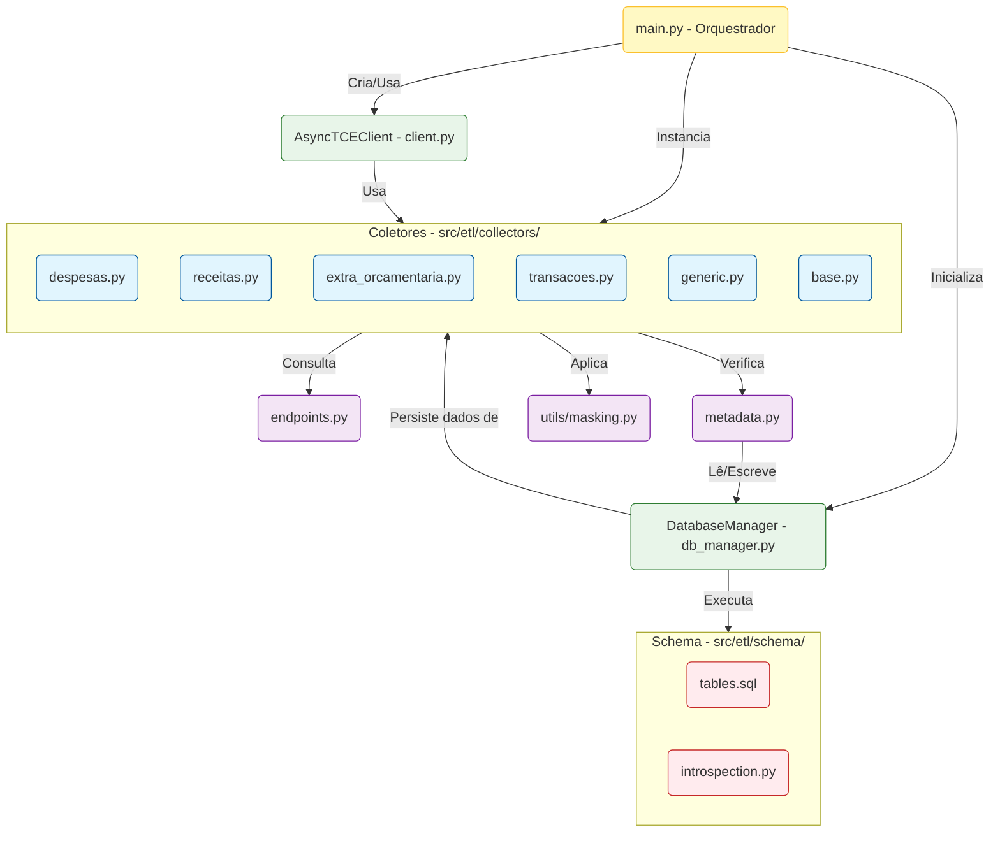

# 📚 Documentação do ETL — Visão Geral e Arquitetura

> **Projeto**: Public Audit Agent
> **Módulo**: `src/etl/`
> **Última atualização**: Fevereiro de 2026

---

## 1. Visão Geral

O módulo ETL (Extract, Transform, Load) é responsável por **extrair dados públicos** das APIs do **TCE (Tribunal de Contas do Estado)**, transformá-los e carregá-los em um banco de dados local **DuckDB**. Esses dados incluem despesas, receitas, licitações, contratos, notas fiscais, agentes públicos e diversas tabelas dimensionais de referência.

O objetivo do ETL é construir um **data warehouse local** com dados fiscais e orçamentários de municípios, que posteriormente será utilizado por um agente de IA para análise e auditoria automatizada.

### 1.1 Arquitetura do Sistema

A arquitetura do ETL foi projetada para ser modular, resiliente e eficiente. Abaixo, o diagrama e a descrição dos componentes principais:



### 1.2 Estrutura de Diretórios

O projeto está organizado da seguinte forma:

```
src/etl/
├── __init__.py                    # Pacote ETL
├── client.py                      # Clientes HTTP (async) para API do TCE
├── db_manager.py                  # Gerenciador de banco de dados DuckDB
├── endpoints.py                   # Definição de todos os endpoints da API
├── main.py                        # Orquestrador principal do ETL
├── metadata.py                    # Controle de idempotência / status de execução
├── collectors/
│   ├── __init__.py                # Pacote collectors
│   ├── base.py                    # Classes abstratas (BaseCollector, MonthlyCollector)
│   ├── despesas.py                # Coletor de despesas orçamentárias
│   ├── receitas.py                # Coletor de receitas orçamentárias
│   ├── extra_orcamentaria.py      # Coletores de despesas/receitas extra-orçamentárias
│   ├── generic.py                 # Coletor genérico para endpoints padrão
│   └── transacoes.py              # Coletor de transações (licitações, contratos, etc.)
├── schema/
│   ├── __init__.py                # Pacote schema
│   ├── tables.sql                 # DDL completo: CREATE TABLE + CREATE INDEX
│   └── introspection.py           # Introspecção do schema (DESCRIBE, SHOW TABLES)
└── utils/
    └── masking.py                 # Mascaramento de dados sensíveis (LGPD)
```

### 1.3 Fluxo Geral de Execução

1. **Configuração**: `main.py` lê as configurações (município, anos, retenção) do `config.yaml`.
2. **Inicialização**: Cria o `DatabaseManager` e executa `initialize_schema()` que roda o `tables.sql`.
3. **Descoberta de Tarefas**: Para cada ano × endpoint, cria uma tarefa. Tarefas são priorizadas:
   - **Prioridade 0**: Tabelas dimensionais sem parâmetros (ex.: `municipios`, `funcoes`).
   - **Prioridade 1**: Endpoints simples (não especializados, não paginados).
   - **Prioridade 2**: Endpoints especializados ou paginados (os mais pesados e complexos).
4. **Verificação de Idempotência**: Antes de cada tarefa, `ETLMetadataManager` verifica se o par `(município, ano, source)` já foi `COMPLETED`. Se sim, pula a execução.
5. **Execução**: O collector adequado faz as requisições HTTP à API do TCE com *rate limiting*, *circuit breaker* e *retry*.
6. **Persistência**: Os dados são transformados e inseridos no DuckDB via UPSERT (para evitar duplicatas).
7. **Processamento Sequencial por Ano**: Na execução via CLI, cada ano é processado sequencialmente (um `asyncio.run()` por ano), com pausa de 2 segundos entre eles para evitar bloqueios WAF.

### 1.4 Tecnologias e Conceitos-Chave

| Tecnologia | Uso |
|---|---|
| **Python 3.12+** | Linguagem principal |
| **asyncio + aiohttp** | I/O assíncrono para chamadas HTTP paralelas |
| **DuckDB** | Banco de dados analítico embarcado (data warehouse local) |
| **pandas** | Manipulação de DataFrames para carga de dados |
| **pybreaker** | Implementação de Circuit Breaker |
| **Parquet** | Formato intermediário para bulk inserts no DuckDB |

*   **Rate Limiting**: Limite de **5 requisições concorrentes** por segundo via `asyncio.Semaphore`.
*   **Circuit Breaker**: **20 falhas consecutivas** bloqueiam novas requisições por **30 segundos**.
*   **Idempotência**: Status rastreado na tabela `etl_metadata`.
*   **UPSERT**: `ON CONFLICT (id) DO UPDATE SET ...` garante atualização sem duplicatas.
*   **Privacidade (LGPD)**: Mascaramento de CPFs (mantendo CNPJs visíveis).

---

## 2. Módulo `client.py` — Cliente HTTP

Este módulo contém a classe **`AsyncTCEClient`**, responsável por toda a comunicação com a API do TCE.

### 2.1 Funcionalidades Principais
*   **Gerenciamento de Sessão**: Utiliza uma `aiohttp.ClientSession` persistente e lazy-loaded, otimizada com `TCPConnector(limit=0)` e cache de DNS (`ttl_dns_cache=300`).
*   **Controle de Concorrência**: Utiliza um `asyncio.Semaphore` configurado com limitador de 5 requisições simultâneas.
*   **Resiliência**: Método `fetch_json` implementa loop de retentativas (padrão 3) com *backoff exponencial* (1s, 2s, 4s...) para falhas transientes.
*   **Circuit Breaker**: A classe `AsyncCircuitBreaker` monitora falhas e muda estados:
    *   `CLOSED` (normal): Requisições fluem.
    *   `OPEN` (falha): Bloqueia requisições e lança erro imediato durante o timeout (30s).
    *   `HALF-OPEN`: Testa a API com uma requisição. Se sucesso, fecha; se falha, reabre.

### 2.2 Diagrama de Fluxo de Requisição

```mermaid
flowchart TD
    Start([fetch endpoint, params]) --> Build[build_url endpoint]
    Build --> FetchJSON[fetch_json url, params]

    subgraph RetryLoop [Loop de Tentativas 1...N]
        direction TB
        CallCB[AsyncCircuitBreaker.call]
        CheckOpen{Estado OPEN?}

        CallCB --> CheckOpen
        CheckOpen -- Sim --> Error[Erro: CircuitBreakerError]
        Error --> ReturnNone([Retorna None])

        CheckOpen -- Não --> MakeReq[_make_request]
        MakeReq --> Sem[semaphore.acquire]
        Sem --> Session[session.get url, params]

        Session -- 404 --> RetEmpty([Retorna {}])
        Session -- Sucesso 200 --> RetJSON([Retorna JSON])
        Session -- Erro 5xx/Timeout --> Backoff[Aguardar Backoff]
        Backoff --> CallCB
    end

    RetJSON --> End([Fim])
    RetEmpty --> End
```

---

## 3. Módulo `endpoints.py` — Definição dos Endpoints

Define o catálogo completo da API do TCE através do Enum `Endpoint`.

### 3.1 Estrutura do Enum
Cada endpoint carrega quatro propriedades:
1.  **path**: Caminho relativo da URL (ex.: `/licitacoes`).
2.  **base**: Qual URL base usar (`DEFAULT` ou `SIM`).
3.  **table_name**: Nome da tabela de destino no DuckDB.
4.  **response_key**: Chave JSON opcional para extração dos dados.

### 3.2 Catálogo de Endpoints

#### Financeiros (Mensais)
| Endpoint | Path | Tabela |
|---|---|---|
| `DESPESAS` | `/balancete_despesa_orcamentaria` | `despesas` |
| `RECEITAS` | `/balancete_receita_orcamentaria` | `receitas` |

#### Extra-Orçamentários
| Endpoint | Path | Tabela |
|---|---|---|
| `BALANCETE_DESPESA_EXTRA` | `/balancete_despesa_extra_orcamentaria` | `balancete_despesa_extra` |
| `BALANCETE_RECEITA_EXTRA` | `/balancete_receita_extra_orcamentaria` | `balancete_receita_extra` |

#### Talões (Receitas Detalhadas)
| Endpoint | Path | Tabela |
|---|---|---|
| `TALOES_RECEITAS` | `/taloes_receitas` | `taloes_receitas` |
| `TALOES_EXTRAS` | `/taloes_extras` | `taloes_extras` |

#### Licitações e Contratos
| Endpoint | Path | Tabela |
|---|---|---|
| `LICITACOES` | `/licitacoes` | `licitacoes` |
| `CONTRATOS` | `/contrato` | `contratos` |
| `CONTRATADOS` | `/contratados` | `contratados` |
| `ITENS_LICITACOES` | `/itens_licitacoes` | `itens_licitacoes` |
| `LICITANTES` | `/licitantes` | `licitantes` |

#### Fiscais
| Endpoint | Path | Tabela |
|---|---|---|
| `NOTAS_FISCAIS` | `/notas_fiscais` | `notas_fiscais` |
| `NOTAS_PAGAMENTOS` | `/notas_pagamentos` | `notas_pagamentos` |
| `ITENS_NOTAS_FISCAIS` | `/itens_notas_fiscais` | `itens_notas_fiscais` |

#### Pessoal e Ciclo de Despesa
| Endpoint | Path | Tabela |
|---|---|---|
| `AGENTES_PUBLICOS` | `/agentes_publicos` | `agentes_publicos` |
| `LIQUIDACOES` | `/liquidacoes` | `liquidacoes` |

#### Tabelas Dimensionais (Lookups)
`MUNICIPIOS`, `ORGAOS`, `UNIDADES_ORCAMENTARIAS`, `FUNCOES`, `ORDENADORES`, `CONTAS_BANCARIAS`, `PROGRAMAS`, `PROJETOS_ATIVIDADES`, `ORCAMENTO_RECEITA`.

---

## 4. Módulo `db_manager.py` — Gerenciamento de Banco de Dados

O `DatabaseManager` centraliza o acesso ao **DuckDB**, garantindo segurança e integridade.

### 4.1 Principais Funcionalidades

1.  **Conexão Segura e Thread-Safe**:
    *   Gerencia uma conexão persistente e utiliza um `threading.Lock` para serializar o acesso, já que o DuckDB não suporta escrita concorrente no mesmo arquivo por múltiplas threads.
    *   Abstrai o caminho do banco e migra extensões antigas (`.db`, `.sqlite`) para `.duckdb`.

2.  **Inicialização do Schema**:
    *   Executa o script `tables.sql` via `initialize_schema()`.
    *   Opera de modo idempotente com `CREATE TABLE IF NOT EXISTS`.

3.  **Segurança (Anti-Injection)**:
    *   Mantém uma *allowlist* (`ALLOWED_TABLES`) com os nomes de todas as tabelas válidas.
    *   Método `_validate_table_name` impede execução em tabelas não autorizadas.

4.  **Carga de Dados (`load_data`)**:
    *   Recebe lista de dicionários ou DataFrame.
    *   Usa **cache de colunas** para evitar introspecção repetida.
    *   Filtra automaticamente colunas do input que não existem na tabela de destino.
    *   Executa **UPSERT**: `INSERT OR REPLACE INTO ...` se a tabela tiver PK `id`, ou `INSERT` simples caso contrário.

---

## 5. Módulo `collectors/` — Estratégias de Coleta

Os coletores encapsulam a lógica de extração para diferentes tipos de endpoints.

### 5.1 Arquitetura de Classes

```
BaseCollector (ABC)
├── MonthlyCollector (ABC)  ← Itera 12 meses em paralelo
│   ├── ExpensesCollector   ← Paginação complexa
│   ├── RevenueCollector    ← Sem paginação
│   ├── DespesaExtraOrcamentariaCollector
│   ├── ReceitaExtraOrcamentariaCollector
│   └── TransacoesCollector ← Versátil (datas e paginação mista)
│
└── GenericCollector        ← Universal (endpoints padronizados)
```

### 5.2 Estratégias de Coleta

#### `BaseCollector` e Bulk Upsert
Implementa `bulk_upsert` utilizando arquivos **Parquet temporários**.
1.  Converte dados para DataFrame.
2.  Salva como `.parquet` (compressão e tipos nativos).
3.  Executa SQL no DuckDB lendo direto do arquivo Parquet.
4.  Remove o arquivo temporário.
*Isso é significativamente mais rápido que inserts linha a linha.*

#### `MonthlyCollector`
Otimiza endpoints mensais disparando **12 requisições paralelas** (uma por mês) usando `asyncio.gather`.

#### Coletores Especializados
*   **`despesas.py`**: Lida com resposta paginada onde o total vem no cabeçalho. Busca a página 0, descobre o total, e dispara requests paralelos para as demais páginas.
*   **`receitas.py`**: Simples e direto, pois retorna o mês inteiro em uma chamada.
*   **`transacoes.py`**: Gerencia endpoints complexos (Licitações, Contratos) que usam intervalos de datas (`YYYY-MM-DD_YYYY-MM-DD`) em vez de mês referência, e mapeia nomes de parâmetros variáveis (ex: `data_contrato` vs `data_realizacao_licitacao`).

#### `GenericCollector`
Inteligente o suficiente para lidar com três tipos de endpoints baseados na configuração:
1.  **Sem Parâmetros**: Tabelas globais como `MUNICIPIOS`.
2.  **Paginação Padrão**: Endpoints como `AGENTES_PUBLICOS` (usa loop sequencial para garantir integridade).
3.  **Simples**: Endpoints que requerem município/ano mas não paginam (ex: `ORGAOS`).
Também realiza a "augmentação" dos registros (geração de ID e mascaramento).

---

## 6. Módulo `schema/` — Definição do Banco de Dados

O arquivo `tables.sql` define as 24 tabelas do sistema.

### 6.1 Padrão de Tabela
Todas as tabelas principais seguem um design consistente:

```sql
CREATE TABLE IF NOT EXISTS nome_tabela (
    id TEXT PRIMARY KEY,           -- Hash SHA-256 determinístico
    municipio_id TEXT,             -- Código do município partition key
    exercicio_orcamento TEXT,      -- Ano fiscal do dado
    raw_data JSON,                 -- Cópia fiel do dado original da API
    updated_at TIMESTAMP DEFAULT CURRENT_TIMESTAMP,
    -- ... campos específicos ...
);
```

*   **`id`**: Gerado como hash **SHA-256** do conteúdo do registro (`{municipio}_{hash}_{ano}`).
*   **`raw_data`**: Garante que nenhum dado original seja perdido, permitindo reprocessamento futuro sem nova coleta API.

### 6.2 Principais Categorias e Tabelas

*   **Licitações**: `licitacoes` (procurements).
*   **Contratos**: `contratos`, `contratados`, `licitantes`, `itens_licitacoes`.
*   **Finanças**: `despesas` (detalhada), `receitas`.
*   **Extra-Orçamentário**: `balancete_despesa_extra`, `balancete_receita_extra`.
*   **Talões**: `taloes_receitas` e `taloes_extras`.
*   **Fiscal**: `notas_fiscais`, `notas_pagamentos`.
*   **Pessoal**: `agentes_publicos` (com CPF mascarado).
*   **Metadados**: `etl_metadata` (status de execução).
*   **Dimensionais**: `municipios`, `orgaos`, `funcoes`, `programas`, etc.

### 6.3 Introspecção (`introspection.py`)
Utilitário que permite consultar o schema em tempo de execução (`get_all_tables`, `get_schema`), reconstruindo comandos DDL a partir do banco e facilitando buscas por tabelas.

---

## 7. Orquestração e Utilitários

### 7.1 `main.py` — O Maestro
Define a **prioridade de execução** para otimizar o tempo de carga:
1.  **Prioridade 0 (Dimensionais)**: Tabelas pequenas e globais.
2.  **Prioridade 1 (Simples)**: Endpoints rápidos.
3.  **Prioridade 2 (Pesados)**: Tabelas mensais e paginadas.

Implementa também o processamento CLI que itera sobre anos sequencialmente, pausando 2 segundos entre cada ano para "esfriar" o rate limiter e evitar bloqueios.

### 7.2 `metadata.py` — Gestão de Estado
A classe `ETLMetadataManager` rastreia o ciclo de vida de cada tarefa: `STARTED` → `COMPLETED` ou `FAILED`. Isso garante **idempotência**: se o ETL rodar novamente, ele pula o que já foi concluído com sucesso.

### 7.3 `utils/masking.py` — Privacidade e LGPD
Funções para sanitização de dados sensíveis.
*   **`mask_cpf(value)`**: Transforma `12345678901` em `***.456.789-**`. Mantém os dígitos centrais para análise estatística anonimizada.
*   **`sanitize_record`**: Verifica automaticamente se a tabela possui campos sensíveis (configurados em `SENSITIVE_FIELDS`) e aplica a máscara antes da inserção no banco.
